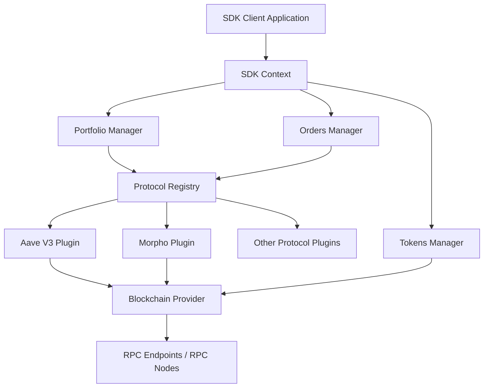

# SDK Architecture

The ReDeFi SDK is designed with a modular architecture that separates the core engine, protocol plugins, and blockchain interactions.

## High-Level Architecture

The following diagram illustrates the high-level architecture of the SDK and how different components interact:

## Component Breakdown

1. **SDK Context**: The central configuration and state container that holds references to all managers and providers.
2. **Managers**:
   - **Portfolio Manager**: Aggregates user positions across different protocols.
   - **Orders Manager**: Handles the creation and simulation of cross-protocol operations (intents).
   - **Tokens Manager**: Provides token metadata and balances.
3. **Protocol Registry**: A dynamic registry where individual DeFi protocols (like Aave, Morpho) are registered as plugins. This allows the SDK to be easily extensible.
4. **Blockchain Provider**: Abstracts the underlying blockchain interaction (using `viem` and `ethers`), making it easy to switch RPC providers.
