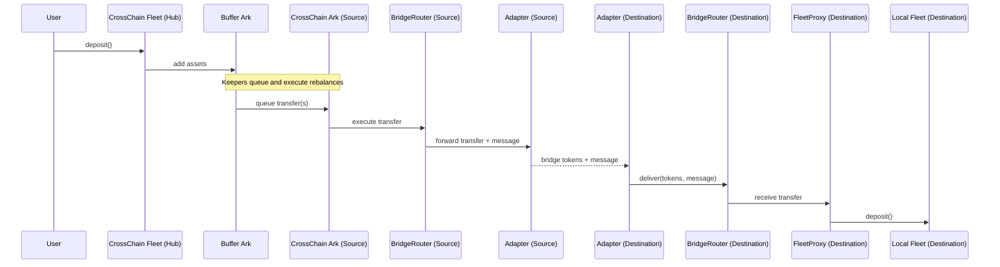

### Cross-Chain Overview

This document explains, at a high level, how Summer's cross-chain system moves assets between chains
as part of fleet management. Users interact with fleets as usual; cross-chain movement is an
internal, keeper-led rebalancing process.

#### What is a CrossChain Fleet?

- A CrossChain Fleet is a fleet deployed on a hub chain that can allocate capital across multiple chains.
- Users deposit to the CrossChain Fleet using the same interface as regular fleets.
- Deposits first accumulate in a Buffer Ark; keepers then rebalance from the buffer to one or more CrossChain Arks targeting other chains.

#### Core Components

- **CrossChain Fleet (Hub)**: User entry point and strategy accounting.
- **Buffer Ark**: Staging area for new capital prior to cross-chain deployment.
- **CrossChain Ark (Source)**: Per-target-chain vehicle that executes cross-chain transfers.
- **BridgeRouter**: Bridge coordination contract that validates adapters and forwards operations.
- **Bridge Adapters**: Protocol-specific adapters (e.g., Stargate, LayerZero) that bridge tokens and
  messages.
- **FleetProxy (Destination)**: Gatekeeper on the destination chain that accepts calls only from the
  local BridgeRouter and deposits into the local fleet after registry validation of the source.
- **CrossChainRegistry**: Authoritative mapping of valid Ark ↔ Proxy pairs across chains; checked
  on both source and destination.
- **Keepers**: Off-chain agents that plan and execute rebalances (queue and execute transfers).

#### End-to-End Flow (Keeper-led)

#### Security at a Glance

- Registry-first validation on source and destination: invalid relationships revert immediately.
- Recipients trust only the local BridgeRouter; the router authenticates adapters and verifies
  adapter peer mappings via the registry during delivery.
- Pausing and governance-controlled emergency actions at routers/proxies.
- Reentrancy protection on critical entry points.

Note on withdrawals:

- Disembark (withdraw) checks ensure sufficient local assets. Cross-chain withdrawals are initiated
  on the destination by keepers via `FleetProxy.withdrawAndTransfer(...)` and delivered back to the
  Ark on the hub chain.

#### Where to go next

- Rebalancing details: `docs/cross-chain/REBALANCING_FLOW.md`
- Router and adapters: `docs/cross-chain/BRIDGE_ROUTER_AND_ADAPTERS.md`
- Registry and security: `docs/cross-chain/REGISTRY_AND_SECURITY.md`
- Operations playbook: `docs/cross-chain/OPERATIONS_PLAYBOOK.md`
