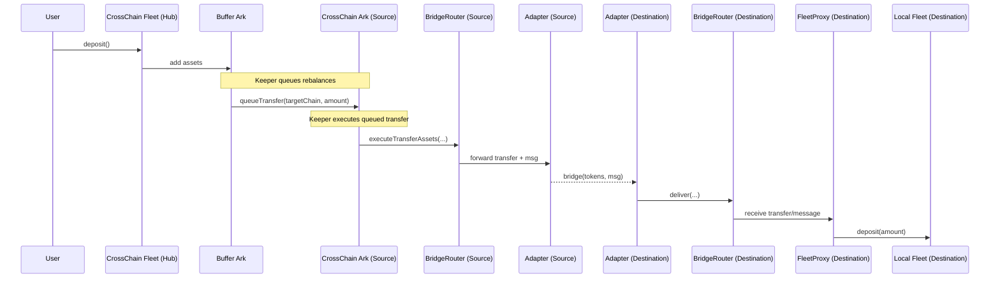

### Keeper-Led Rebalancing Flow

This document describes the operational sequence from user deposits through keeper-led rebalancing
to destination fleets.

#### High-Level Steps

1. Users deposit into the CrossChain Fleet (hub chain) via the standard fleet interface.
2. Assets accrue in the Buffer Ark.
3. Keepers decide target allocations per destination chain and queue transfers (including full
   ExecuteTransferParams and BridgeOptions) from the Buffer Ark to the respective CrossChain Ark(s).
4. A registered executor (keeper) executes the queued transfers by calling the CrossChain Ark on the
   source chain.
5. The CrossChain Ark routes the transfer to the BridgeRouter, which forwards to a selected,
   registered adapter.
6. The adapter bridges the tokens plus a small operation message to the destination chain.
7. The destination adapter calls its local BridgeRouter.
8. The destination BridgeRouter calls the FleetProxy corresponding to the target local fleet.
9. The FleetProxy deposits into the local fleet.

#### Sequence Diagram

#### Validation and Checks

- Source chain: CrossChain Ark consults CrossChainRegistry to ensure a valid Ark ↔ Proxy
  relationship for the target chain. Router execution is gated by `onlyAuthorizedExecutor` (keepers
  must be registered executors).
- Destination chain: Router authenticates adapters and peer mappings; FleetProxy trusts only the
  router, then validates the source Ark + chain pair via the registry before depositing.

#### Events and Monitoring (typical)

- Router/adapter lifecycle events (transfer initiated, delivered, failed).
- FleetProxy deposit event on the destination chain.
- Keeper systems should track queue state, executed amounts, inflightAssets updates on Ark, and any
  recoverable failures from adapters.

Additional reconciliation cues:

- Ark: `inflightAssets` is best-effort set by the router; `lastRemoteAssetBalance` updates on
  message/read responses that match the latest outgoing transferId.
- FleetProxy: updates `latestIncomingTransferId` on deposits and can notify the source chain with
  its current `fleetBalance`.

#### Failure Modes (typical)

- Bridge delivery failure: assets may be held by the adapter’s fail-safe; recover per adapter’s
  documented procedure.
- Registry mismatch: destination rejects delivery; investigate registry sync/state across chains.
- Pause state: routers or proxies may be paused by guardians/governance; resume only after incident
  resolution.

Withdrawals (destination → hub):

- Keepers on the destination chain call `FleetProxy.withdrawAndTransfer(amount, options)`, which
  withdraws from the local fleet and bridges assets back to the Ark on the hub chain.
