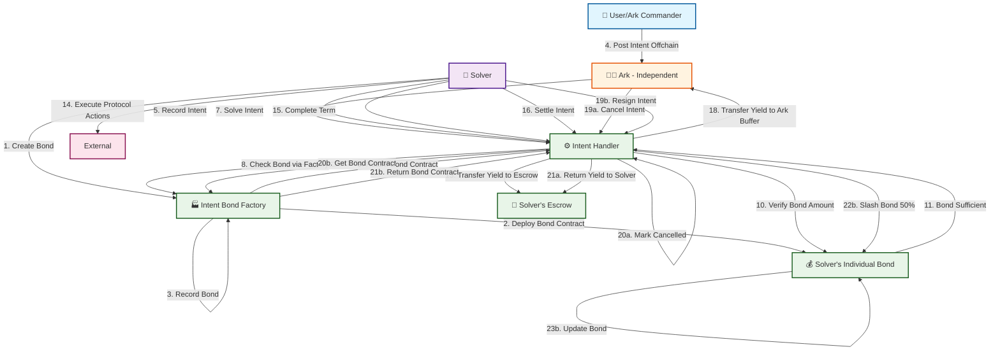
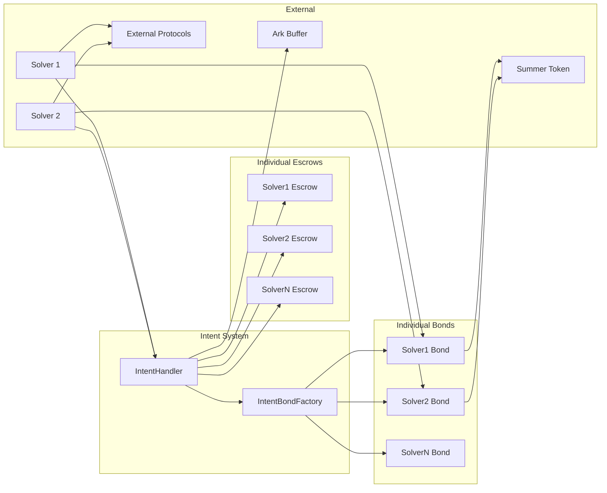
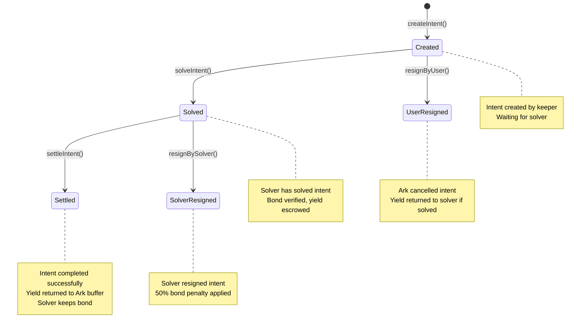

# Intent-Based Bond System

## Overview

The Intent-Based Bond System is a CoW Swap-style bonding mechanism where **each solver creates their own individual bond contract** via a factory. The system operates independently from Arks - Keeper posts intents on behalf of arks and the intent system only checks if an Ark is committed to an intent. When an intent is settled, yield is returned to the Ark's buffer.

## Architecture

### System Components

- **IntentBondFactory**: Factory that creates individual bond contracts for each solver
- **SolverBond**: Individual bond contract per solver (Summer tokens only)
- **IntentHandler**: Manages intent lifecycle, bond verification, and commitment checking
- **Escrow**: Individual escrow contracts per solver for holding yield during intent execution

## Flow Diagram



## Detailed Flow Steps

### 1. Solver Bond Creation
- **Solver** calls `IntentBondFactory.createBond(solver)`
- **Factory** deploys new `SolverBond` contract for that solver
- **Factory** records the mapping of solver → bond contract
- **Solver** now has their own isolated bond contract

### 2. Intent Creation (Offchain)
- **User/Commander** posts intent with requirements (notional, term, yield, etc.)
- **Ark** records the intent offchain (independent from intent system)
- **IntentHandler** creates intent in `Created` state via keeper call

### 3. Intent Solving
- **Solver** sees intent and calls `solveIntent(intent, escrowedYield)` directly
- **IntentHandler** checks if solver has bond contract via factory
- **IntentHandler** verifies solver has sufficient bond in their individual contract
- **IntentHandler** transfers target yield from solver to solver's escrow
- Intent transitions to `Solved` state

### 4. Intent Execution
- **Solver** executes solveIntent() - intent yield amount is pulled to solvers escrow
- **Keeper** is obledged to deposit to solvers protocol (there's 10 minute buffer)
- Yield remains escrowed in solver's individual escrow contract

### 5. Intent Settlement
- **Solver** completes the term and calls `settleIntent()` (permissionless)
- **IntentHandler** withdraws yield from solver's escrow
- **IntentHandler** transfers yield to Ark's buffer via FleetCommander
- Intent transitions to `Settled` state
- **Solver** keeps their bond in their individual contract

### 6. Commitment Checking
- **Ark** can check if they're committed to an intent via `hasCommitted()`
- Returns required notional, ark assets, and commitment status
- Includes buffer time check (10 minutes) after solving

### 7. Alternative Paths
- **Ark can cancel** intent before solving via `resignByUser()` (only in `Created` state)
- **Solver can resign** intent via `resignBySolver()` (50% bond penalty from their individual contract)

## Key Features

- ✅ **Individual bond contracts** per solver (complete isolation)
- ✅ **Individual escrow contracts** per solver for yield holding
- ✅ **Factory pattern** for easy bond creation
- ✅ **Independent Ark operation** - arks work offchain, system only checks commitment
- ✅ **Direct solver execution** - no Ark approval bottlenecks
- ✅ **Summer token bonds only** - simple and clean
- ✅ **50% penalty** for solver resignations
- ✅ **Buffer time protection** - 10-minute grace period after solving
- ✅ **Yield to buffer** - settled intents return yield to Ark's buffer

## Contract Interactions



## State Transitions



## Commitment Checking

The system provides a `hasCommitted()` function that Arks can use to check their commitment status:

```solidity
function hasCommitted(Intent memory intent) external view 
    returns (uint256 requiredNotional, uint256 arkAssets, bool isCommited)
```

**Commitment Logic:**
1. **Buffer Time**: 10-minute grace period after solving (BUFFER_TIME)
2. **Asset Check**: Compares Ark's total assets against required notional
3. **Status Return**: Returns commitment status and relevant amounts

**Use Cases:**
- Arks can verify their commitment before taking actions
- Risk management and position sizing
- Compliance and reporting requirements

## Benefits

1. **Complete Isolation**: Each solver has their own bond and escrow contracts
2. **Factory Pattern**: Easy to create new bonds for new solvers
3. **Independent Arks**: Arks operate offchain, system only checks commitment
4. **Minimal Code**: Clean separation of concerns
5. **Overly Simple**: Easy to understand and maintain
6. **CoW Swap Style**: Individual bonding pools per solver
7. **Efficient Flow**: No approval bottlenecks
8. **Simple Design**: No complex protocol integrations
9. **Buffer Protection**: Grace period for Ark commitment verification
10. **Yield Management**: Automatic yield return to Ark buffer

## How It Works

1. **Solver creates bond**: `factory.createBond(solver)` → deploys `SolverBond` contract
2. **Ark posts intent offchain** with requirements (notional, term, yield, etc.)
3. **Keeper creates intent** on-chain via `createIntent()`
4. **Solver solves intent** directly by calling `solveIntent(intent, escrowedYield)`
5. **System verifies** solver has sufficient bond in their individual contract
6. **Yield is escrowed** in solver's individual escrow contract
7. **Solver executes** protocol actions externally (not through intent system)
8. **Solver settles** when term completes via `settleIntent()`
9. **Yield returns** to Ark's buffer via FleetCommander
10. **Bond stays** in solver's individual contract (no shared pools)

## Key Differences from Previous Design

- ❌ **No GenericIntentArk**: Arks work independently offchain
- ❌ **No Ark approval**: Solvers solve intents directly
- ❌ **No Protocol Adapters**: Solvers execute externally
- ✅ **Commitment checking**: System only verifies Ark commitment status
- ✅ **Buffer yield return**: Settled intents return yield to Ark's buffer
- ✅ **Individual escrows**: Each solver has their own escrow contract
- ✅ **Buffer time protection**: 10-minute grace period for commitment verification

This system is **minimal as possible** and **overly simple** as requested, with Arks operating independently and the intent system focusing solely on bond management and commitment verification! 🎉
